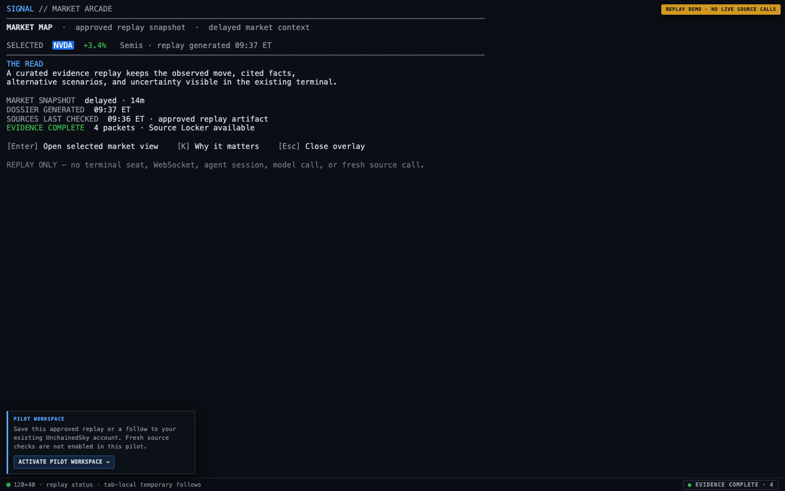
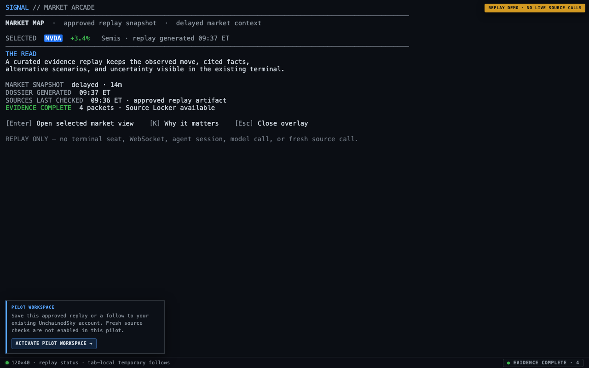
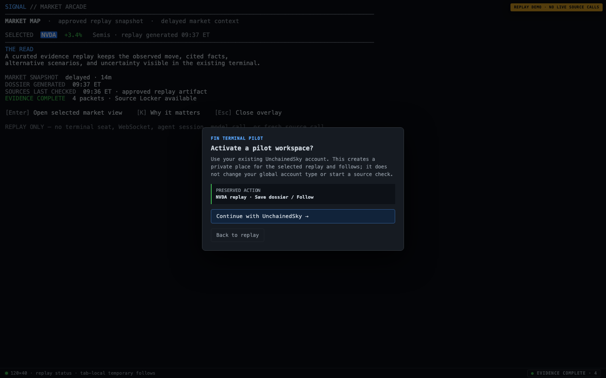

# PRD — Fin Terminal Replay Demo, Account Activation, and Personal Workspace

| Field | Content |
| --- | --- |
| Feature Name | Fin Terminal replay demo and account activation |
| Requirement Type | PRD-ai-native |
| Current Status | Phase 1 pilot decisions recorded; Phase 2 source checks gated |
| Related Modules | Public demo, UnchainedSky identity, Fin Terminal entitlement, personal workspace, source-check jobs |
| Updated At | 2026-08-01 |

**What this cycle only solves:** a concurrent, read-only Fin Terminal demo and pilot-allowlisted workspace activation under an existing UnchainedSky account. Phase 1 uses only approved immutable replay content; it does not make the legacy terminal multi-tenant or run fresh source checks before source licensing is approved.

## 1. Module Positioning

The module lets a market researcher inspect a curated, source-backed replay without cost or contention, then activate a personal Fin Terminal workspace when they ask to check the evidence again or keep a research trail.

Phase 1 produces an account-owned reference to the approved parent dossier plus saved research and follows. Phase 2 may produce an account-owned child dossier after an approved fresh source check. Neither phase produces a new global UnchainedSky login or a shared terminal session.

## 2. Feature Goal

### User value

- See a credible explanation of a market move before being asked to sign in.
- Preserve the exact report that motivated activation instead of landing in an empty product.
- Re-check sources and retain research privately under the same UnchainedSky account used elsewhere on the site.

### AI value

- In Phase 1, perform no costly source-backed research. In Phase 2, perform it only after an accountable user explicitly requests it and the approved source policy permits it.
- Communicate source-check progress, freshness, and uncertainty without implying real-time market data.
- Produce versioned evidence rather than silently replacing a prior conclusion.

### Success criteria

1. Public replay visitors never contend for a terminal seat and never trigger model or source work while browsing.
2. A signed-in user can activate Fin Terminal without changing their existing UnchainedSky account type or other product access.
3. Phase 1 never queues source/model work; a source-check request is transparently unavailable until its licensing gate is met. Phase 2 returns the user to the exact parent dossier and yields one observable outcome: changed, unchanged, partial, blocked, failed, or cancelled.
4. Saved dossiers and follows are visible only to their owner workspace.
5. The public demo, activation flow, and private workspace use accurate freshness and delayed-data language.

### Non-goals

- Converting the current singleton terminal into a multi-user product in this cycle.
- Live market data, guaranteed source availability, arbitrary public ticker research, or public model execution.
- Alerts, notes, portfolio tracking, sharing, team workspaces, RBAC, billing, or a general-purpose memory feature.
- Replacing or adding a value to the existing UnchainedSky `user_type` model.
- Enabling fresh source checks, source/model spend, or billing during the Phase 1 pilot.

### Product decision: what “Fin Terminal account type” means

**Fin Terminal access is an additive product entitlement and a personal workspace under an existing UnchainedSky identity.** It is not a replacement value in the global account’s `user_type` field.

An UnchainedSky user may remain on an existing product path while separately holding Fin Terminal access. The Fin Terminal entitlement answers whether the person may use the product; the workspace answers who owns its saved research and jobs.

### Fin Terminal entitlement lifecycle

Fin Terminal access is evaluated independently of the global UnchainedSky account status. A valid global identity is a prerequisite, but global `user_type` is neither copied into nor used as a Fin Terminal authorization state.

| Entitlement state | Meaning | Workspace behavior | Permitted next transition |
| --- | --- | --- | --- |
| No entitlement | The identity has not activated Fin Terminal | No private workspace or job access | Activation pending, active, or ineligible |
| Activation pending | Identity is valid, but eligibility, terms acknowledgement, or provisioning is unresolved | No private workspace or job access | Active, ineligible, or revoked |
| Active | Entitlement, product subject, workspace, and required terms acknowledgement are committed | Read/write owned workspace access; new work remains subject to plan and abuse policy | Suspended or revoked |
| Suspended | Temporary product-access hold | Existing workspace is read-only; no intent claim, save/follow mutation, retry, or source work | Active or revoked |
| Revoked | Product access was removed | No private workspace or job access; data follows retention/deletion policy | New activation only if policy permits |
| Ineligible | The valid global identity cannot activate under the launch policy | No private workspace or job access | Activation pending or active if policy changes |

Activation must record the entitlement state, plan/capability label, product subject, accepted terms version, acknowledgement time, and activation source. A rejected or otherwise invalid global account cannot activate or use Fin Terminal; any existing product records follow the retention/deletion policy.

### Decided launch parameters and phase boundary

- **Activation:** Phase 1 is a no-billing, pilot-allowlisted activation. Eligibility is stored against the stable UnchainedSky user ID, never email. The visible capability label is `Pilot workspace — source checks unavailable`.
- **Legacy terminal:** The entitlement grants only the new personal workspace. It does not admit a user to the existing singleton terminal or alter its allowlist.
- **Service boundary:** A dedicated Fin Terminal workspace service owns entitlement projection, product subject, workspace, intent, saves/follows, and later jobs. It requires a durable relational store with transactional uniqueness/claim semantics and a durable job mechanism; the legacy in-process terminal archive and session state are not eligible stores.
- **Source policy:** Phase 1 serves only approved immutable replay artifacts. Fresh source checks and private child versions are feature-flagged off until permitted sources, retention, excerpt handling, and withdrawal rules are approved.
- **Private-data policy:** The draft [data lifecycle and support-access proposal](fin-terminal-demo-data-lifecycle-proposal.md) governs Phase 1 private data pending product/legal approval.

### Launch phases

| Phase | Included | Explicitly excluded | Exit gate |
| --- | --- | --- | --- |
| Phase 1 — replay/workspace pilot | Public approved replay, tab-local exploration, pilot activation, saved parent references, follows, and private workspace access | Source jobs, source/model spend, private child dossiers, billing, and legacy-terminal admission | Data lifecycle policy approved; pilot monitoring verifies isolation and ownership |
| Phase 2 — fresh source checks | Explicit account-owned check, idempotent job, cited child version, result states, and bounded retry | Unlicensed sources, arbitrary public research, and real-time-data claims | Named licensed source profile, user-visible quota/cooldown, spend circuit breaker, and job service readiness approved |

## 3. User Scenarios

### Scenario A — Anonymous replay visitor activates a pilot workspace

1. A visitor opens a curated Fin Terminal replay and selects a default mover, headline, or ticker.
2. They inspect the complete dossier, its evidence packets, and its timestamps without authentication.
3. They choose **Activate pilot workspace** or save the dossier/follows. A disabled **Check sources again** affordance may explain that fresh checks are not enabled in this pilot.
4. The system preserves an expiring request for that exact public dossier and sends the visitor through normal UnchainedSky sign-in or registration.
5. After pilot activation, the workspace opens the original dossier and persists only the selected save/follow action.
6. No source-check job begins. If the visitor asked for a fresh check, the workspace shows that source checks are pending the licensed-source release and keeps the original parent visible.

### Scenario B — Existing UnchainedSky user activates Fin Terminal

1. A signed-in UnchainedSky user reaches the same CTA.
2. They review product-specific terms, delayed-data notice, source-use notice, and plan/eligibility information.
3. The system creates or reactivates their Fin Terminal entitlement and personal workspace without changing their existing global account type.
4. The preserved request is claimed once and its selected save/follow action resumes. A Phase 1 source-check request returns the unavailable state and is not persisted as an intent, job, or waitlist record unless the user separately opts into a future disclosed program.

### Scenario C — Phase 2 source checking is incomplete or unavailable

1. A workspace user requests a source check.
2. Some sources are blocked, rate-limited, unavailable, or do not materially change the report.
3. The system describes the state accurately and keeps the original dossier visible.
4. The user may inspect what was checked, retry when policy permits, or retain the original research. The system never replaces valid evidence with an empty failed result.

## 4. Dual-Track Collaboration Definition

| Stage | Human action | AI / research action | System feedback | Boundary |
| --- | --- | --- | --- | --- |
| Replay | Selects a curated item and reads the dossier | None; replay is immutable | Cached/replay status, market-data as-of, dossier-generated time, and source-check availability | No WebSocket, agent session, model call, or arbitrary symbol lookup |
| Intent | Phase 1 chooses Activate pilot workspace, Save dossier, or Follow; Phase 2 may choose Check sources again | None | Explains that authentication is required and what will be preserved | Only allowlisted artifact/action/follows are recorded |
| Identity and activation | Signs in or registers with UnchainedSky; accepts product terms | None | Restoring request, activation pending/active, or eligibility explanation | Global identity is separate from Fin Terminal authorization |
| Source check | Explicitly confirms the requested action through the CTA | Retrieves and synthesizes allowed current sources | Queued, checking, changed, unchanged, partial, blocked, failed, or cancelled | One owner-bound, idempotent job; no promise of real-time market data |
| Workspace memory | Saves a dossier or follows a ticker | May reuse the user-approved parent version as context for a later check | Saved/private confirmation and version lineage | Save only to the owner workspace; no implicit team sharing |

**Phase 1 rule:** the Source check row is inactive. A replay or workspace interaction must not enqueue a job, contact a fresh source, or invoke a model. The source-check rows elsewhere in this PRD define the gated Phase 2 contract.

## 5. Diagram overview

- [Separate-session architecture](diagrams/fin-terminal-demo-session-architecture.drawio): defines the public replay, identity/intent, workspace/job, and result planes.
- [Activation and source-check flow](diagrams/fin-terminal-demo-activation-flow.drawio): defines the visitor-to-workspace path and its safe failure branches.

## 6. Main flow and stage transitions

1. **Load public replay.** Browser receives a versioned, curated manifest and immutable public dossiers.
2. **Create a tab-local replay session.** Selection, navigation, and temporary follows live only in the current browser tab.
3. **Inspect evidence.** The user sees full source packets and existing terminal-style freshness labels for market data, dossier generation, and source-check availability.
4. **Create a bounded intent.** In Phase 1, only a save or follow action records an allowlisted artifact/version, bounded follow list, safe return location, and requested action. Phase 2 may add Check sources again under the same bounds.
5. **Authenticate and activate.** Existing UnchainedSky identity is validated; a pilot-allowlisted Fin Terminal entitlement and personal workspace are created or reactivated if eligible.
6. **Claim and preserve.** The workspace claims the intent once, opens the original artifact, and persists only the approved save/follow request in Phase 1.
7. **Gated source-check phase.** Only after the Phase 2 exit gate, the workspace starts or reattaches to one idempotent source-check job and publishes a child version after an actual check. Partial/blocked/failed outcomes retain the parent and explain the limitation.

## 7. Page structure and information layout

### Visual scope boundary

This feature must **not** redesign the Fin Terminal. It preserves the current full-screen terminal frame, status line, `demo-banner`, interaction overlay, and Source Locker. Phase 1 may add only compact status/copy treatment and a small activation prompt that follows the existing select-modal/overlay pattern. It must not introduce a new three-column application shell, mover rail, dashboard, or workspace canvas.

### 7.1 Replay demo

**Entry:** public Fin Terminal demo route.

**Changed areas:**

- Keep the existing terminal grid and keyboard interaction model intact; render only approved static replay rows in the new replay entry.
- Reuse the existing `demo-banner` and status line for `REPLAY DEMO`, freshness, evidence, and source-check-unavailable treatment.
- Keep Source Locker in its existing compact status-control/overlay pattern rather than adding a persistent inspector column.
- Use a compact activation trigger/prompt for Activate pilot workspace, Save dossier, and temporary Follow. Check sources again is informational/disabled until Phase 2.

**Required feedback:**

- `REPLAY DEMO — no live source calls`
- `Market snapshot: delayed · as of …`
- `Dossier generated: …`
- `Sources last checked: …`
- `Evidence: complete | partial | unavailable`
- `Temporary follows: this tab only`
- `Fresh source checks are not enabled in this pilot`

### 7.2 Identity and activation return

**Entry:** a replay visitor presses Activate pilot workspace, Save dossier, or Save follows. Phase 2 adds Check sources again.

The normal UnchainedSky sign-in/registration flow remains the identity authority. On return, the product uses a compact Fin Terminal activation prompt/overlay rather than treating the global account as automatically entitled or introducing a new activation page.

**Required feedback:**

- `Restoring your research request`
- The selected dossier title and requested action
- Product terms, delayed-data disclosure, privacy treatment for saved research, and source-use notice before activation
- Clear outcomes for active, pending, suspended, revoked, and ineligible access

### 7.3 Personal workspace result

**Entry:** a claimed intent or a later saved/followed item.

Phase 1 needs no new workspace screen: it returns the user to the existing-terminal visual language with a compact saved/followed confirmation. Phase 2 source-check progress, version comparison, and retry UI are product-contract requirements only; their visual design is intentionally deferred so they do not imply an approved terminal redesign.

**Required feedback:**

- Phase 1: `Saved to pilot workspace`, `Following in pilot workspace`, or `Source checks unavailable in this pilot`
- Phase 2 (future): `Checking sources…`, outcome status, parent/child timestamps, and a policy-bound retry control

### 7.4 Visual handoff

The design reference, ASCII layout, screen contract, component mapping, and implementation notes are in [`ui/`](ui/). They document a minimal overlay/banner treatment on the current terminal rather than a new information architecture. They are visual handoff artifacts, not production UI code.

## 8. AI State Feedback Design

| User-visible state | Meaning | User choice | Required system behavior |
| --- | --- | --- | --- |
| Replay complete | Curated, immutable dossier with usable evidence | Inspect, Follow temporarily, Activate pilot workspace | Do not make source/model calls |
| Replay partial | Some public evidence is incomplete | Inspect known evidence or choose another item | Do not conceal the limitation or imply a complete answer |
| Authentication required | A durable action was requested | Sign in, register, or cancel | Preserve the public dossier; no job begins yet |
| Activation pending | Identity is valid but product activation is unresolved | Review status or return to replay | Do not expose private APIs or start a job |
| Restoring intent | Authentication/activation succeeded | Wait or return to original dossier | Reattach only to the preserved, safe intent |
| Source checks unavailable | Phase 1 licensing gate has not been met | Save parent, follow, or leave the pilot | Do not create a job, call a source, invoke a model, or imply that a check is queued |
| Queued / checking (Phase 2) | An owner-bound source check is running | Inspect parent, wait, cancel where allowed | Show distinct research progress; preserve parent |
| Changed (Phase 2) | A new or corrected cited claim was found in an actual source check | Compare, save, follow | Publish a child version with lineage, source times, and changed claims |
| Unchanged (Phase 2) | The configured source-check minimum completed with no new or corrected cited claim | Keep parent, follow, check later | State that check completed; do not manufacture a version |
| Partial / blocked / failed (Phase 2) | Some or all work was unavailable, prohibited, or errored | Inspect limitation, retry where allowed | Keep parent, report what remains valid, never blank the result |
| Cancelled (Phase 2) | The user or system stopped a queued/checking job before a result was published | Keep parent and retry later if policy permits | Record that no fresh result was produced; do not manufacture a version |

## 9. Key interaction logic

### Primary conversion action

The Phase 1 primary CTA is **Activate pilot workspace**. It creates no source-check job and makes the limited capability explicit:

> Save this approved research to your private pilot workspace. Fresh source checks are not enabled yet.

**Check sources again** is a Phase 2 CTA. It does not promise a real-time quote or an unrestricted live research session:

> Check allowed public sources again for this dossier. Market data remains delayed.

### Secondary memory actions

- **Follow ticker:** available as a tab-local temporary action in replay; durable only after an account-owned claim.
- **Save dossier:** preserves the selected parent dossier in the personal workspace after activation.
- **Do not gate reading:** full existing evidence is available before sign-in.

### Confirmation points

Phase 1 activation is explicit confirmation to create product access and private workspace memory; it must not spend a source-check budget or transfer a visitor’s entire browser history. In Phase 2, the source-check CTA is a separate explicit confirmation to request a check.

### Source-check outcome and idempotency contract — Phase 2 only

- A **changed** result may publish a child dossier only when the job performed an actual allowed-source check and the child identifies at least one new or corrected claim with its source citation. A cached response alone never satisfies this condition.
- An **unchanged** result means the configured minimum source profile completed and found no new or corrected cited claim. If the minimum cannot complete, report partial, blocked, failed, or cancelled instead of unchanged.
- A **partial** result means some permitted retrieval completed but the configured minimum source profile did not. A **blocked** result means policy, entitlement, quota/cooldown, source restrictions, or a circuit breaker prevented the required work. A **failed** result means an unexpected execution failure. A **cancelled** result means work stopped before a result was published.
- A job is idempotent within the tuple `workspace_id + parent_artifact_id + parent_version + requested_action + research_policy_version`. Duplicate submissions for an active or recently completed tuple must return the existing job/result rather than spend another source-check budget.
- Every job records the parent artifact/version, research-policy version, source-check start/end times, outcome, retry eligibility, and the actor/product subject. The parent remains immutable and readable throughout.

## 10. Data closed loop and memory layer

| Layer | What persists | Owner | Reuse rule |
| --- | --- | --- | --- |
| Public replay | Curated immutable dossier/version and manifest | No visitor owner | Any visitor may inspect while content remains licensed and available |
| Browser replay | Selection, navigation cursor, temporary follows | Current tab only | Never treated as trusted identity or copied wholesale into an account |
| Pending intent | Selected allowlisted artifact/version, requested action, bounded follows, safe return target | One browser transaction until claimed | Expires; claims once only |
| Personal workspace | Phase 1: saved parent references and follows. Phase 2: refresh jobs and private child versions | Fin Terminal workspace | May be reopened by authorized workspace members only; refresh/compare features require Phase 2 |

The system must retain a versioned parent when it creates a child report. It must not save private notes, arbitrary user prompts, broader browsing state, or alert preferences in this MVP.

## 11. Module breakdown and input/output

| Module | Product responsibility | Input | Output |
| --- | --- | --- | --- |
| Public content plane | Publish curated replay content safely | Approved static dossier set | Versioned public manifest and replay artifacts |
| Browser replay plane | Provide independent public exploration | Manifest plus tab-local actions | Private-to-tab selection and temporary follows |
| UnchainedSky identity | Authenticate the human | Existing account session or registration | Stable global identity and global account status |
| Fin Terminal activation | Grant product access independently | Identity, eligibility, terms acknowledgement | Product entitlement, product subject, personal workspace |
| Intent bridge | Preserve one conversion action through identity flow | Allowlisted public artifact/action | One-time, expiring claimable intent |
| Workspace/job plane | Phase 1: persist owned saves/follows. Phase 2: perform/display owned research | Claimed intent and active workspace | Phase 1 saved reference/follow; Phase 2 versioned result and job state |

## 12. Human Takeover Mechanism

- A user must explicitly activate Fin Terminal access. A user must separately and explicitly request a source check when Phase 2 is enabled.
- A user can cancel sign-in/activation and continue viewing the public parent dossier.
- A user can inspect sources and distinguish checked facts from unavailable or partial evidence.
- Product administrators may suspend or revoke product access under documented policy; this stops new work without deleting the user’s global UnchainedSky account.
- When a source check cannot continue, the system stops automatic continuation, preserves the parent, and offers only policy-permitted recovery.

## 13. Exceptions and Boundaries

| Condition | Required response |
| --- | --- |
| Demo traffic attempts to invoke terminal WebSocket or agent | Reject by architecture: replay bundle must not mount terminal session providers or open the socket |
| Artifact, ticker, action, follows, or return path is modified | Reject the intent and retain the public replay safely |
| Authentication is cancelled | Return to the original public dossier; no private record/job is created |
| Product entitlement is pending, suspended, revoked, or ineligible | Explain product-access status; no intent claim or job starts |
| Callback is replayed or opened in multiple tabs | Resolve to the existing entitlement/workspace/job; never duplicate the job |
| Phase 1 visitor requests a source check | Explain that source checks are unavailable; preserve the parent and create no job, source call, model call, or spend |
| Phase 2 source check is partial, blocked, rate-limited, failed, or cancelled | Preserve parent dossier, state the limitation, expose retry only when allowed |
| Public content is withdrawn for licensing or legal reasons | Tombstone only the affected public artifact and retain enough explanation for existing references |
| User changes email | Preserve product subject and workspace ownership; never use email as an owner key |

## 14. Acceptance Criteria

### Public demo isolation

- [ ] Opening and using the demo creates no terminal WebSocket, agent session, panel, lease, model call, source call, archive mutation, or canonical watchlist mutation.
- [ ] Concurrent visitors can select different replay items without exposing or changing each other’s selection, cursor, or follows.
- [ ] A high-concurrency replay load produces no busy-seat response and no source/model spend attributable to browsing.
- [ ] Both anonymous and signed-in pilot replay use cases create no source/model work; a Phase 1 source-check request has the same zero-work guarantee.
- [ ] Phase 1 replay status distinguishes market-data delay, dossier-generation time, evidence completeness, and explicit source-check unavailability. Phase 2 adds source-check time.

### Identity and Fin Terminal access

- [ ] Existing UnchainedSky users keep their existing global `user_type` behavior while activating Fin Terminal.
- [ ] Pilot eligibility is stored and evaluated by stable UnchainedSky user ID, not by email, global `user_type`, or a client-supplied header.
- [ ] Activation retries create at most one entitlement, product subject, personal workspace, and owner membership.
- [ ] Activation records the terms version, acknowledgement time, plan/capability label, product subject, and lifecycle state without copying or changing global `user_type`.
- [ ] A missing entitlement can reach activation but cannot access private workspace APIs or start a job.
- [ ] Suspended/revoked access immediately blocks new claims and source work; queued workers recheck authorization before execution.
- [ ] A suspended workspace is read-only; a revoked workspace is inaccessible except through approved support/deletion paths.
- [ ] Changing email does not alter principal, workspace, or resource ownership.

### Phase 1 intent and memory

- [ ] An intent can be claimed once by one workspace, only after identity and product authorization succeed.
- [ ] A callback replay returns the already-created workspace/save/follow state rather than duplicating a private mutation.
- [ ] An intent ID, claim token, product subject, or user identifier never appears in a URL, document title, or referrer-visible redirect target.
- [ ] A Phase 1 source-check request always returns the explicit unavailable state and creates no job, source call, model call, or private child version.
- [ ] One workspace cannot read another workspace’s saved parent references or follows.

### Phase 2 source-check acceptance — gated

- [ ] The source-check feature flag remains off until the Phase 2 exit gate in §2 is approved.
- [ ] A callback replay returns the already-created job/result rather than enqueueing another source check.
- [ ] A source check creates a child dossier only after an actual check; reused cached content is visibly labeled as reused.
- [ ] A changed child includes a new or corrected cited claim; an unchanged result is emitted only after the configured minimum source profile completes without such a claim.
- [ ] Partial, blocked, and failed jobs leave the parent dossier intact and readable.
- [ ] Cancelled jobs leave the parent dossier intact, publish no child version, and show retry eligibility.
- [ ] One workspace cannot read another workspace’s saved dossiers, follows, job state, or unpublished versions.

### Measurement and launch gates

- [ ] Phase 1 funnel instrumentation captures replay engagement, activation CTA click, identity completion, activation, intent restoration, saved parent/follow action, evidence inspection, and D1/D7 second action.
- [ ] Phase 1 operations can demonstrate zero source/model cost attributable to the replay and workspace pilot.
- [ ] Phase 2 operations can measure source/model cost, deduplication rate, latency, partial/failure rate, and abuse-adjusted cost per retained workspace before enabling refresh conversion.
- [ ] The product does not launch the Phase 2 refresh conversion path while callback binding, ownership enforcement, idempotency, source licensing, quota/cooldown, or public-content licensing remain unverified.

## 15. Items to Confirm Before Implementation Planning

| Topic | Status | Decision / approval needed |
| --- | --- | --- |
| Eligibility | Decided | Phase 1 is pilot-allowlisted, no billing. |
| Phase 1 capability | Decided | Label it `Pilot workspace — source checks unavailable`; do not expose a quota because no source-check work exists. |
| Source policy | Decided for Phase 1 | Serve only approved immutable replay content. Phase 2 remains blocked on named licensed sources, retention/excerpt terms, withdrawal/tombstoning, quota/cooldown, and spend limits. |
| Workspace service boundary | Decided | A dedicated durable Fin Terminal workspace service owns private data/jobs; select the concrete relational store and job mechanism during technical design. |
| Legacy terminal | Decided | Self-service entitlement grants workspace-only access; legacy terminal remains independently allowlisted. |
| Deletion and support | Proposed | Review and approve [the data lifecycle and support-access proposal](fin-terminal-demo-data-lifecycle-proposal.md) before Phase 1 implementation. |
| Future teams | Deferred | Optimize the initial model for personal workspaces only; do not add team abstractions without a new decision. |

---

## Local draft appendix — technical handoff (not a final implementation plan)

### A. Impact scope

| Area | Intended change | Not changed in this cycle |
| --- | --- | --- |
| Fin Terminal web client | Add a demo-specific replay entry that does not mount the terminal socket/session flow | Canonical terminal interaction logic remains unchanged |
| Public demo deployment | Serve approved immutable replay content without a shared seat | No public live agent research or fresh source checks in Phase 1 |
| UnchainedSky control plane | Add product activation and authorization separate from global account type | Existing identity providers and global account semantics |
| Fin Terminal workspace | Phase 1: add personal ownership for saved parent references and follows. Phase 2: add child dossiers and jobs | Legacy shared archive as a self-service data store |
| Proxy authorization | Distinguish identity-only activation from active-entitlement private routes | Client-supplied identity headers remain untrusted |

### B. Product object to implementation-object mapping

| Product object | User-visible meaning | Implementation object | Notes |
| --- | --- | --- |
| UnchainedSky identity | Existing signed-in account | Existing stable account identity | Global `user_type` remains unchanged |
| Fin Terminal entitlement | May use Fin Terminal | Product access record with lifecycle and plan | One per identity; not email-keyed |
| Fin Terminal subject | Opaque product identity | Persisted random product subject | Safe proxy principal; not derived owner key |
| Personal workspace | Private saved research area | Workspace plus owner membership | All private resources reference workspace ownership |
| Public dossier | Replay content | Versioned public artifact/manifest | Ownerless, allowlisted, licensed, tombstonable |
| Pending intent | Request to check/save/follow after sign-in | Expiring one-time intent | Carries bounded allowlisted inputs only |
| Source-check job | Phase 2 requested research work | Idempotent workspace-owned job | Feature-flagged off in Phase 1; actor recorded for audit; parent preserved |

### C. Authorization matrix

| Surface | Required identity | Required Fin entitlement | Required workspace membership | Result if absent |
| --- | --- | --- | --- | --- |
| Public replay | None | No | No | Read-only replay remains available |
| Intent creation | Anonymous browser transaction or signed-in identity | No | No | Reject malformed/capped requests |
| Activation | Valid UnchainedSky identity | No; creates/recovers it | No | Send to sign-in or show global account state |
| Private workspace | Valid active identity | Active; suspended is read-only | Yes | 401 for identity failure; 403 for access failure; no mutations while suspended |
| Save/follow | Valid active identity | Active | Yes | Persist only workspace-owned allowed mutation |
| Source check (Phase 2) | Valid active identity | Active | Yes | Feature-flagged off in Phase 1; preserve parent / deny new private mutation |
| Legacy terminal | Explicit future decision | Not sufficient | Not sufficient | Out of scope for self-service launch; entitlement alone must not change the existing allowlist behavior |

### D. Security and session contract

- Define **separate demo session** as browser-isolated replay state in `sessionStorage` plus a short-lived server-side intent only when a durable action is requested.
- Do not create a per-visitor AgentSession, panel, terminal WebSocket, or terminal seat for replay.
- Treat browser selections as untrusted hints. Validate every artifact, version, ticker, action, follows list, and return path against the public manifest and strict limits.
- Bind a one-time intent claim transactionally to one authenticated workspace. Use a high-entropy, secure, HttpOnly, SameSite cookie for browser correlation and normal OAuth/OIDC state, PKCE, nonce, and CSRF protections where applicable.
- Never place an intent ID, claim token, product subject, or user identifier in a URL, document title, or referrer-visible redirect target. Return locations are route-relative allowlist entries plus a public artifact/version identifier only.
- Return only opaque trusted product principal information through the proxy. Do not forward email as a general owner key, and strip all client-supplied identity headers before injecting trusted ones.
- Keep source-job execution feature-flagged off in Phase 1. Recheck active entitlement/workspace authorization before costly work starts and when a Phase 2 queued job resumes.

### E. Compatibility, migration, and rollback

1. Add entitlement, product subject, workspace, and membership records without changing existing global account type values.
2. Backfill currently authorized Fin Terminal operators idempotently with an auditable legacy activation source.
3. Shadow-evaluate product authorization against the existing allowlist before switching admission.
4. Launch replay demo without any terminal WebSocket dependency.
5. Enable pilot activation/intent claim behind a feature flag. Do not add account-bound source checks until the Phase 2 exit gate, bounded spend, and cooldowns are approved.
6. Keep a time-bounded legacy allowlist fallback for rollback. Do not roll back by rewriting global account type or deleting owned workspace data.
7. Keep the existing `handle_fin_terminal_auth` and its `X-Fin-Terminal-User` principal legacy-terminal-only. Private workspace routes require a separately persisted Fin Terminal product subject and authorization check.

### F. Suggested verification matrix

- Two concurrent anonymous replay tabs with independent selection/follows.
- Anonymous and signed-in pilot replay load tests demonstrating zero terminal socket/model/source work, including an unavailable source-check request.
- Existing global account types activating Fin Terminal without mutation.
- Duplicate activation, callback replay, cross-tab callback, expired intent, swapped cookie, and invalid return path.
- Intent/job identifiers absent from browser URLs and referrer-visible redirects.
- Cross-workspace object access, email change, global account suspension, product suspension, and deletion initiation.
- Phase 2 only: source-check changed, unchanged, partial, blocked, failed, cancelled, cached-reuse, queue/cooldown, and cost-circuit-breaker cases.
